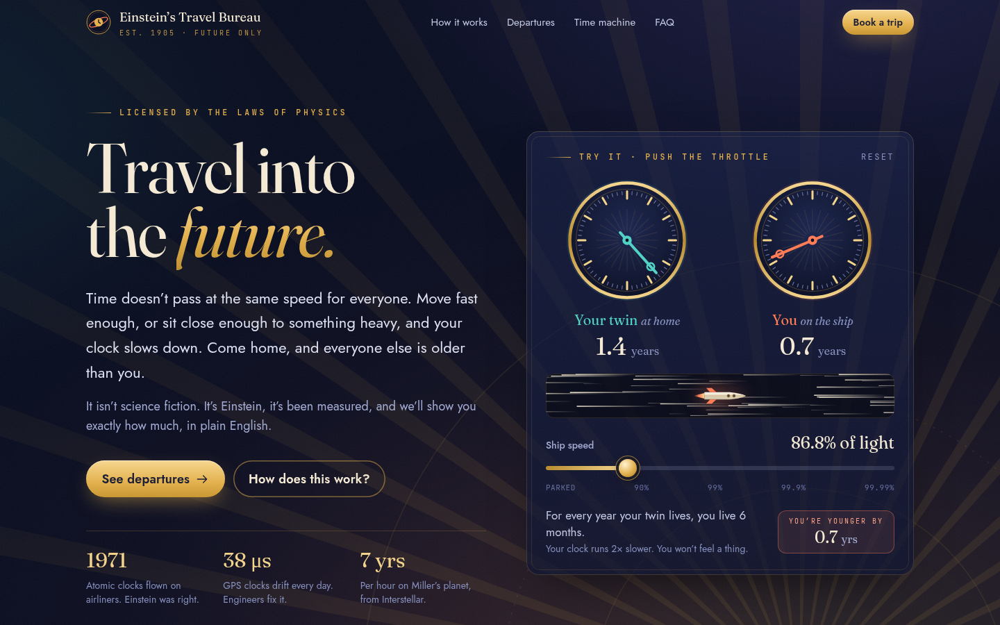
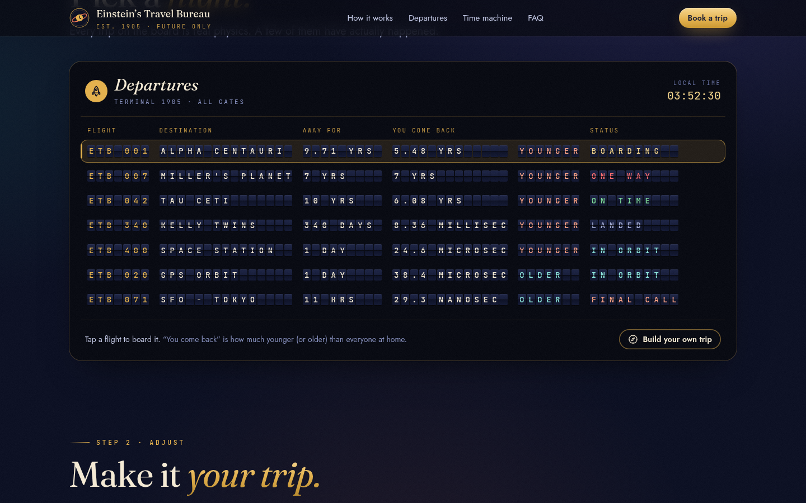
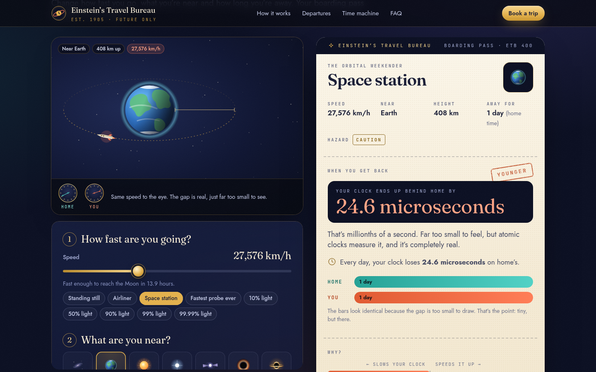

**[Launch the bureau →](https://nasseralbusaidi.github.io/einsteins-travel-bureau/)**

[](https://github.com/NasserAlbusaidi/einsteins-travel-bureau/actions/workflows/ci.yml)
[](LICENSE)

# Einstein's Travel Bureau

> Travel into the future. It's real.
> Est. 1905 · Future only.



A 1930s interstellar travel bureau, open at night, that sells trips into the future. Pick a trip — a long-haul flight, the space station, a black hole — and the bureau tells you, in plain English, how much younger (or older) you'd come back, and why.

No physics background needed. Every number still comes from Einstein's actual equations, computed at 50-digit precision, and the full working is one click away under **Show the math**.





## How it works (for visitors)

1. **Push the throttle.** The hero is a live demo: two clocks, you and your twin, and a speed lever. Push towards light speed and watch your clock fall behind while a counter keeps score.
2. **Learn the two rules.** Moving fast slows your clock. Being near something heavy slows your clock. And it only goes one way. Three travel posters, no equations.
3. **Pick a flight.** Seven real scenarios on a split-flap departures board, from SFO → Tokyo to Miller's planet in *Interstellar*. Every row already shows how much younger (or older) you come back.
4. **Make it your trip.** A live scene shows where you are: the body you're near (Earth, the Sun, a white dwarf, a pulsar, Sgr A*, Gargantua), your ship's orbit and height, stars streaking past at speed, and two clocks ticking at their real relative rates. Four plain controls underneath: how fast, near what, how high, how long.
5. **Read your boarding pass.**
   - The headline: *"You aged 4.23 years. Home aged 9.71 years."* Or, for tiny effects, *"Your clock ends up 38.4 microseconds ahead of home."*
   - The aging race: two bars that grow at the two clocks' real relative rates.
   - **Why?** A tug of war between the speed part and the gravity part (GPS: speed loses 7.2 μs/day, altitude gains 45.7 μs/day, gravity wins).
   - What you missed while you were away, a shareable link, and **Show the math**.
6. **Time machine.** Run it backwards: "Take me to the year 3000 while I only age 1 year." You get two ways there (cruise at 99.999947% of light speed, or hover 311 km above Gargantua's edge), each bookable in one click.
7. **FAQ.** Is this real? Why does speed slow time? Can I go back? Why can't I go faster than light?

## Run it

```bash
npm install
npm run dev        # → http://localhost:5173/einsteins-travel-bureau/
npm run lint
npm run typecheck
npm test
npm run build
```

## What's inside

```
src/
├── physics/              ← the science. Knows nothing about the UI.
│   ├── constants.ts      CODATA 2018 + IAU 2015 constants
│   ├── relativity.ts     γ, Schwarzschild radius, combined dilation
│   ├── effects.ts        exact split of a result into speed vs. gravity
│   ├── bodies.ts         Earth, Sun, Sirius B, a neutron star, Sgr A*, Gargantua
│   ├── scenarios.ts      the 7 real-world scenarios
│   └── solver.ts         inverse: "I want ratio X, find v or r"
│
├── trip.ts               the 4-knob trip model ↔ two-observer physics, URL hash codec
├── scales.ts             slider scales (log, and a "nines of light speed" scale)
├── humanize.ts           plain-English formatting: "38.4 microseconds", "90% of light speed"
├── format.ts             SI formatting for the math drawer
├── store.ts              zustand store, synced to the URL hash
│
├── copy/                 ← words, not physics
│   ├── destinations.ts   brochure copy + "what's going on here" per trip
│   ├── places.ts         places, landmarks for every slider
│   └── funFacts.ts       "1 World Cup played without you"
│
├── hooks/motion.ts       animation-frame loop, in-view trigger, reduced-motion check
│
└── components/
    ├── TwinClocks.tsx    hero demo: two clocks and a throttle
    ├── HowItWorks.tsx    the rules as travel posters + "is this real?"
    ├── Departures.tsx    split-flap departures board (the trip picker)
    ├── SplitFlap.tsx     the flip-tile text itself
    ├── TripScene.tsx     live view of the trip: body, orbit, warp, clocks
    ├── TripControls.tsx  speed / place / height / duration
    ├── BoardingPass.tsx  headline, aging race, why, fun facts, share
    ├── MathDrawer.tsx    the real equations and every intermediate value
    ├── TimeMachine.tsx   the solver as "book a ticket to year X"
    ├── Faq.tsx
    ├── Starfield.tsx     the night sky behind everything
    └── art/              hand-drawn SVG: bodies, ship, clock faces, icons
```

## Design contract

**Plain English first, receipts on request.** Every visible number is in units people know (km/h, % of light speed, minutes, years, "millionths of a second"). γ, β, r_s and τ live in the math drawer.

**One colour language.** Coral is always *you*, teal is always *home*, gold is the bureau. Clocks, bars, stats and stamps all follow it, so the page reads at a glance.

**Motion that means something.** Every clock hand turns at the physically correct relative rate; streaking stars scale with your speed. Everything decorative switches off under `prefers-reduced-motion`. Fonts (Fraunces, Jost, JetBrains Mono) are self-hosted, so no third-party requests.

**Two layers, clean seam.** `physics/` has zero React imports and its own tests. Everything else can be reskinned without moving a number.

**"Home" is derived, not configured.** Earth trips compare against someone standing on the ground. Everything else compares against someone far from any mass (Earth's own pull would change those results by less than a billionth). That removes a whole column of confusing controls.

**Precision where it matters.** decimal.js at 50 digits, because float64 rounds `1 − v²/c²` to exactly 1 for anything slower than ~100 m/s — which would erase the flight, the ISS and GPS.

**Every trip is a link.** Untouched presets encode as `#trip=gps`; custom trips as `#v=…&at=earth&h=…&t=…`. Old `#s=<preset>` links still work.

## Scenarios

| id | trip | result |
|---|---|---|
| `twin-paradox` | Alpha Centauri and back at 0.9c | you age 4.23 yr, home ages 9.71 yr |
| `hail-mary` | 10 years at 0.92c | you age 3.92 yr |
| `millers-planet` | parked 78 m above Gargantua's horizon | 1 hour there = 7 years outside |
| `gps` | GPS orbit | +38.4 μs per day (gravity wins) |
| `iss` | International Space Station | −24.6 μs per day (speed wins) |
| `scott-kelly` | 340 days on the ISS | −8.4 ms |
| `flight` | SF → Tokyo, 11 h at 10 km | +29 ns (altitude narrowly wins) |

Add one by appending to `SCENARIOS` in `physics/scenarios.ts` *and* `DESTINATIONS` in `copy/destinations.ts`. Its gravitating body must be one of `physics/bodies.ts`.

## Simplifications

Accelerating, decelerating and turning around are treated as instantaneous. The bureau doesn't check whether a speed is the right one to stay in orbit. Black holes are non-rotating. None of these change the headline numbers for the presets.

## Status

Playground. Physics is real; the bureau is not. No refunds beyond the event horizon.
